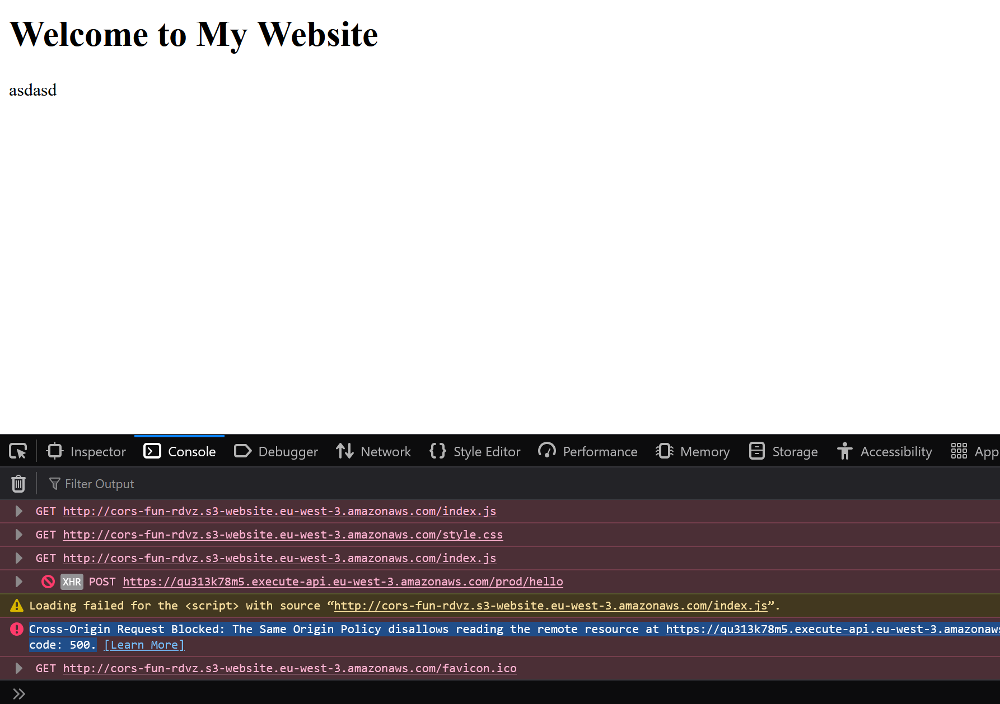

## create bucket
```sh
aws s3 mb s3://cors-fun-rdvz
```

## change block public access
```sh
aws s3api put-public-access-block \
    --bucket cors-fun-rdvz \
    --public-access-block-configuration "BlockPublicAcls=true,IgnorePublicAcls=true,BlockPublicPolicy=false,RestrictPublicBuckets=false"
    ```
## create bucket policy

aws s3api put-bucket-policy --bucket cors-fun-rdvz --policy file://policy.json

## turn on static website hosting
aws s3api put-bucket-website --bucket cors-fun-rdvz --website-configuration file://website.json

## uploa our index.html file and include a resources that would be cross origin

aws s3 cp index.html s3://cors-fun-rdvz


## Get website endpoint for S3
http://cors-fun-rdvz.s3-website.eu-west-3.amazonaws.com/


# Create second website
```sh
aws s3 mb s3://cors-fun2-rdvz
```

## change block public access
```sh
aws s3api put-public-access-block \
    --bucket cors-fun2-rdvz \
    --public-access-block-configuration "BlockPublicAcls=true,IgnorePublicAcls=true,BlockPublicPolicy=false,RestrictPublicBuckets=false"
    ```
## create bucket policy

aws s3api put-bucket-policy --bucket cors-fun2-rdvz --policy file://policy2.json

## turn on static website hosting
aws s3api put-bucket-website --bucket cors-fun2-rdvz --website-configuration file://website.json

## upload js

aws s3 cp hello.js s3://cors-fun2-rdvz

## Updated the html to get the script thingy
```js
<script type="text/javascript" src="http://cors-fun2-rdvz.s3-website.eu-west-3.amazonaws.com/hello.js"></script>
```

---

 DOES NOT WORK

 ## let's make an API gateway
Go to API gateway

Create REST API
Creat POST Mock method

That's url
https://qu313k78m5.execute-api.eu-west-3.amazonaws.com/prod


curl -X POST -H "Content-Type: application/json" https://qu313k78m5.execute-api.eu-west-3.amazonaws.com/prod/hello

## add the post to index.html

see CORS issue


## Let's not setup CORS
```sh
aws s3api put-bucket-cors --bucket cors-fun-rdvz --cors-configuration file://cors.json
```

still not working, need to enable cors to the API go in the ressource


 ## Cleanup

aws s3 rm s3://cors-fun2-rdvz/hello.js
aws s3 rb s3://cors-fun2-rdvz

aws s3 rm s3://cors-fun-rdvz/index.html
aws s3 rb s3://cors-fun-rdvz